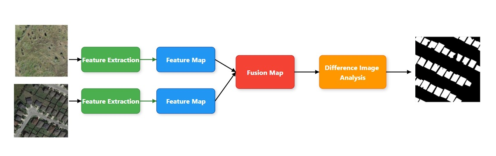
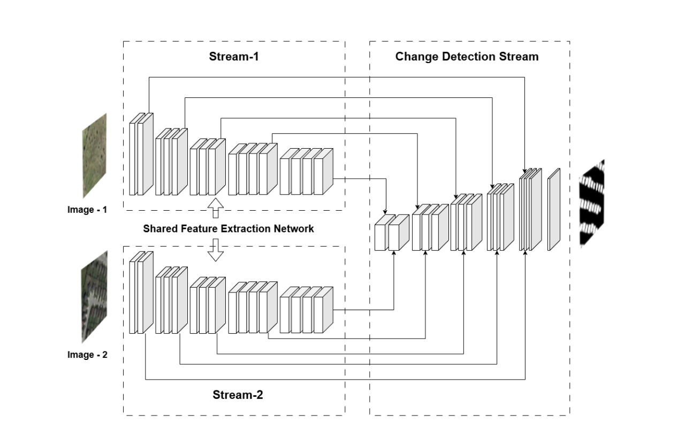

# CNN-based Image Segmentation Models in TensorFlow

This repository contains three CNN-based models (`U-Net`, `U-Net with ResNet`, and `U-Net with DenseNet`) for image segmentation, built using TensorFlow. It includes custom architectures, loss functions, metrics, and data generators, as well as training and evaluation scripts.

---

## 📊 Model Overview

We implement and compare the following models:

- **Model 1**: Basic U-Net variant
- **Model 2**: U-Net with residual connections
- **Model 3**: U-Net with attention blocks

Each model is evaluated on segmentation tasks using custom loss functions (`combo_loss`, `focal loss`, `dice loss`) and metrics like `IoU`, `True Positive Rate`, and `Accuracy`.

---

## 📌 Project Structure

```
Change Detection in Remote Sensing Satellite Images/
    ├── models/
    │    ├──build_unet_model.py
    │    ├──build_unet_resnet_model.py
    │    ├──build_unet_densenet_model.py
    │    └──build_all_models.py
    │
    ├── losses/
    │    └──loss.py
    │
    ├── metrics/
    │    └──metrics.py
    │
    ├── data/
    │    └──image_generator.py
    │
    ├── config/
    │    └──config.py
    │
    ├── img/
    ├── main.py
    ├── train.py
    ├── utils.py
    ├── requirements.txt
    └──README.md
```


---

## Data Flow in Training

The following diagram shows the data pipeline during training:



---

## 🏗️ Model Architectures

We evaluate three architectures:

- **Model 1**: Standard U-Net
- **Model 2**: U-Net with ResNet
- **Model 3**: U-Net with DenseNet

Each model processes 6-channel input images and outputs segmentation maps.

**Architecture Diagram:**



---

## 🧪 Evaluation Metrics

- **IoU (Intersection over Union)**
- **True Positive Rate (TPR)**
- **Pixel Accuracy**
- **F1 Score**

---

## 🎯 Sample Predictions

Here’s a visual comparison of predicted masks from all models:


---

## ⚙️ Configuration

All settings (input shape, learning rate, paths, batch size, etc.) are defined in:

```python
config/config.py
```

## 🧰 Setup Instructions

### 1. Clone the Repository

```
git clone https://github.com/parthu1029/Remote-Sensing-Change-Detection

cd Remote-Sensing-Change-Detection
```

### 2. Create a Virtual Environment
```
python -m venv venv
source venv/bin/activate       # For Unix/Mac
venv\Scripts\activate          # For Windows
```
### 3. Install Dependencies
```
pip install -r requirements.txt
```
### 4. Prepare the Dataset

Place training and validation images in:
```
  dataset/
    ├──train/
    │    ├──A/
    │   ├──B/
    │    └──label/
    ├──val/
    │    ├──A/
    │    ├──B/
    │    └──label/
    └──test/
        ├──A/
        ├──B/
        └──label/
```

(Adjust paths in config/config.py if needed.)

### 5. Train the Model

Run the main training script:

```
python main.py
```

## 🔍 Sample Utility Functions

Inside utils.py:

    set_seed(seed): For reproducibility

    plot_training_curves(history): To visualize training/validation metrics

    count_params(model): Print total trainable parameters

## 📦 Requirements

Installed via requirements.txt:

```
tensorflow==2.15.0
numpy
matplotlib
scikit-learn
opencv-python
Pillow
glob2
albumentations
tqdm
pandas
h5py
pytest
```

Install them with:
```
pip install -r requirements.txt
```

## 📄 License

This project is open-source and available under the **MIT License**.

---

## 👥 Contributors

- **Parthasaradhi G**  
  GitHub: [@parthu1029](https://github.com/parthu1029)  
  Role: Project Author & Developer

- **Siddardha S**  
  GitHub: [@tmfsiddu](https://github.com/tmfsiddu)  
  Role: Contributor / Collaborator

- **Sujith B**  
  GitHub: [@sujith-2424](https://github.com/sujith-2424)  
  Role: Contributor / Collaborator
---


Feel free to open an issue or reach out for questions, collaborations, or feedback.


